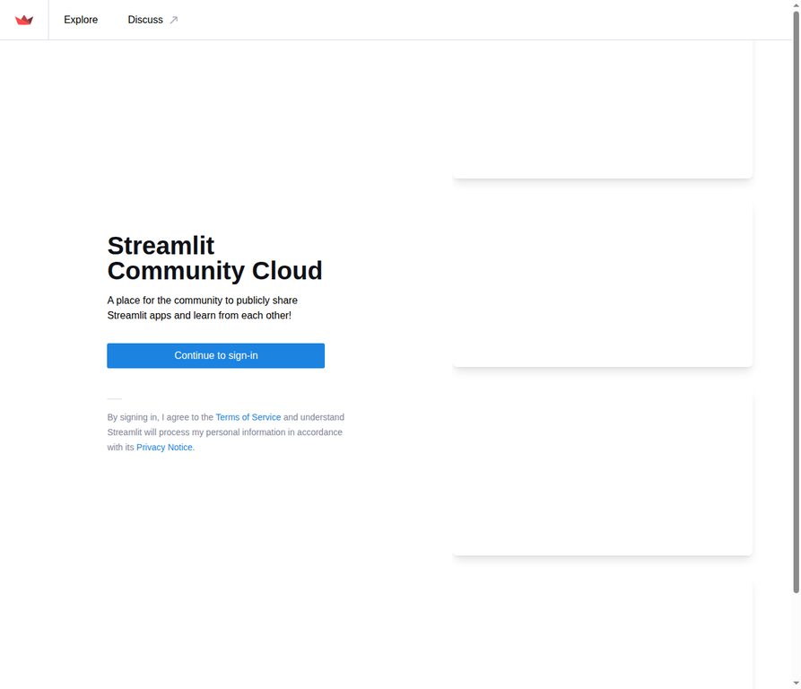
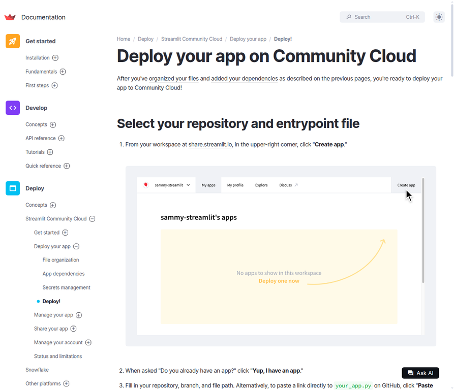
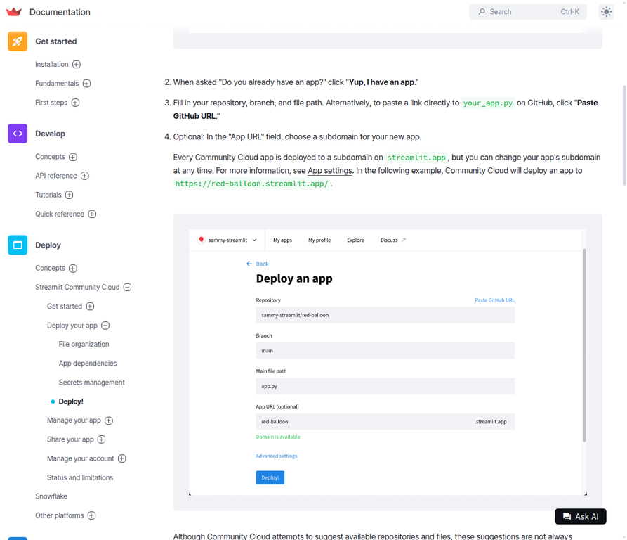
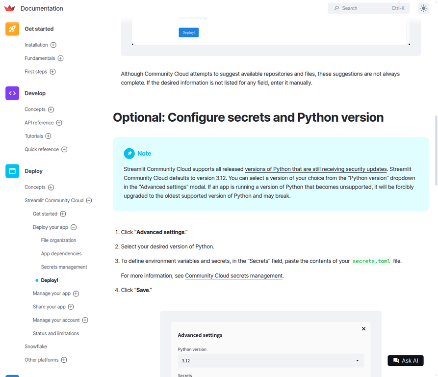
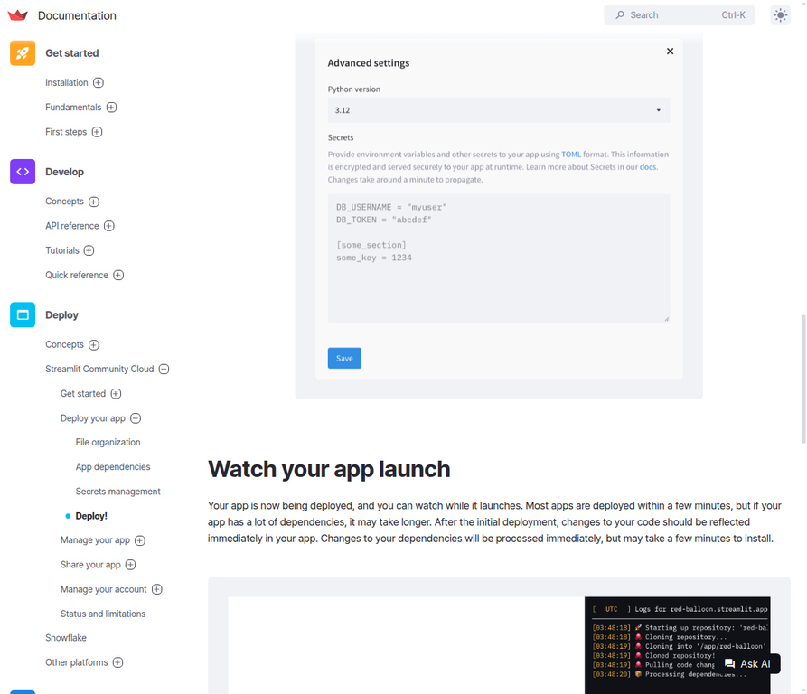
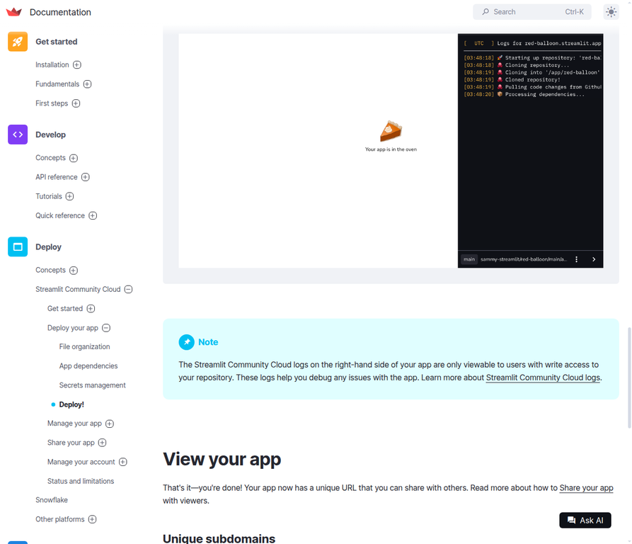

# Streamlit Community Cloud Deployment Guide

**Project:** Gender Detection from Face  
**Repository:** [gm719453-prog/gender-detection-deep-learning](https://github.com/gm719453-prog/gender-detection-deep-learning)

This guide provides a step-by-step walkthrough for deploying the Gender Detection deep learning application to Streamlit Community Cloud. The guide includes screenshots and critical configuration settings to ensure a successful deployment.

---

## Prerequisites

Before deploying, ensure you have the following:

- A GitHub account with access to the project repository
- A Streamlit Community Cloud account (sign in with GitHub)
- The repository is **public** (confirmed)
- Python version **3.12** selected in Advanced Settings (confirmed working)

---

## Step 1: Sign In to Streamlit Community Cloud

Navigate to the Streamlit Community Cloud portal:

**https://share.streamlit.io**

You will see the landing page with a **"Continue to sign-in"** button. Click it to proceed to the authentication screen.



---

## Step 2: Authenticate with GitHub

On the sign-in page, click **"Continue with GitHub"** to authenticate using your GitHub account. This links your Streamlit account to your GitHub repositories.


---

## Step 3: Access Your Workspace

After signing in, you will be redirected to your Streamlit workspace. In the upper-right corner, click **"Create app"** to begin the deployment process.

If asked "Do you already have an app?", click **"Yup, I have an app."**



---

## Step 4: Fill in Deployment Settings

On the **"Deploy an app"** page, fill in the following fields:

| Field | Value |
|-------|-------|
| **Repository** | `gm719453-prog/gender-detection-deep-learning` |
| **Branch** | `main` |
| **Main file path** | `app.py` |
| **App URL (optional)** | Choose a subdomain for your app (e.g., `gender-detection`) |

> **Important:** Do NOT use the full GitHub URL in the Main file path field. Simply enter `app.py`.



---

## Step 5: Configure Advanced Settings (CRITICAL)

This is the most important step. Click **"Advanced settings"** before deploying.



---

## Step 6: Select Python Version 3.12

In the **"Python version"** dropdown, you **must select `3.12`**.

**Why?** Streamlit Community Cloud defaults to Python 3.14, which does NOT have TensorFlow wheels. Python 3.12 is the correct version for TensorFlow 2.16.1 compatibility.



After selecting Python 3.12, click **"Save"**.

---

## Step 7: Deploy the App

Click the **"Deploy!"** button. Streamlit Community Cloud will:

1. Clone the repository from GitHub
2. Provision a machine
3. Install all dependencies from `requirements.txt`
4. Launch the Streamlit application

The deployment typically takes 2-5 minutes. You will see live logs on the right-hand side showing the progress:

```
[03:48:18] Starting up repository: 'red-ba...'
[03:48:18] Cloning repository...
[03:48:19] Cloning into '/app/red-ba'...
[03:48:19] Cloned repository!
[03:48:19] Pulling code changes from Github...
[03:48:20] Processing dependencies...
```



---

## Step 8: Verify the Application is Live

Once deployment is complete, your app will be available at:

```
https://gm719453-prog-gender-detection.streamlit.app
```

The URL may vary based on your chosen subdomain. You will see the Gender Detection web interface with the upload functionality.

---

## Troubleshooting

### Error: "This repository does not exist"
- Ensure the repository is **public** (it should be, as we confirmed earlier)
- Refresh the Streamlit page
- Try signing out and back in to Streamlit

### Error: "installer returned a non-zero exit code"
- This means Python version is wrong (not 3.12)
- Go to **Manage App** → **More options** → **App settings** → change Python to **3.12**
- Click **Save** → **Rerun app**

### Error: "This file does not exist"
- Ensure the Main file path is exactly `app.py` (not a full URL)
- Verify the branch is `main`

### Model Loading Error
- The model file (`models/gender_detection_model.keras`) is committed to the repo
- If missing, run `create_demo_model.py` locally and push the generated `.keras` file

---

## Post-Deployment

After successful deployment, your application will be:

- **Publicly accessible** via the Streamlit URL
- **Auto-updating** — any push to the `main` branch triggers a redeployment
- **Free** on Streamlit Community Cloud (with usage limits)

---

## Quick Reference — Deployment Settings

| Setting | Value |
|---------|-------|
| Repository | `gm719453-prog/gender-detection-deep-learning` |
| Branch | `main` |
| Main file path | `app.py` |
| Python version | `3.12` (in Advanced Settings) |
| App URL subdomain | Your choice (e.g., `gender-detection`) |

---

*Document generated by Manus AI*
